# MAE 469 Orbital Simulator — Function Architecture Diagram

```mermaid
flowchart TD

    %% ═══════════════════════════════════════════════════════
    %%  DATA OBJECTS LAYER
    %% ═══════════════════════════════════════════════════════

    subgraph BODIES["📦 bodies/"]
        subgraph BODY_PY["body.py"]
            B_init["Body.__init__\n(name, mass, radius, pos, vel)"]
            B_soi["Body.soi_radius\n(M_central)"]
            B_oe["Body.get_orbital_elements()"]
            B_update["Body.update_state\n(r, v)"]
            B_init --> B_soi
        end
        subgraph SC_PY["spacecraft.py"]
            SC_init["Spacecraft.__init__\n(name, mass, pos, vel,\nburn_schedule=None)"]
            SC_burn["Spacecraft.apply_burn\n(dv_vector)"]
            SC_add["Spacecraft.add_burn\n(time, dv_vector)"]
        end
    end

    subgraph ENV["📦 environment/"]
        subgraph GRID_PY["grid.py"]
            G_init["SpaceGrid.__init__\n(nx, ny, nz, spacing)"]
            G_pos["SpaceGrid.cell_to_position\n(i, j, k)"]
            G_upd["SpaceGrid.update_potential\n(bodies)"]
            G_grad["SpaceGrid.get_gradient()"]
        end
        subgraph FLD_PY["fields.py"]
            F_pot["compute_potential_field\n(grid, bodies)"]
            F_grad["compute_gradient_field\n(grid)"]
        end
    end

    %% ═══════════════════════════════════════════════════════
    %%  PHYSICS LAYER
    %% ═══════════════════════════════════════════════════════

    subgraph PHYSICS["📦 physics/"]
        subgraph GRAV_PY["gravity.py"]
            GR_2b["gravity_2body\n(bodies)\n⚠ vector bug"]
            GR_nb["gravity_nbody\n(bodies)\n⚠ vector bug"]
            GR_pt["acceleration_at_point\n(point, bodies)"]
        end
        subgraph POT_PY["potential.py"]
            PT_2b["potential_2body\n(bodies)\n⚠ scalar bug"]
            PT_nb["potential_nbody\n(bodies)\n⚠ scalar bug"]
            PT_pt["potential_at_point\n(point, bodies)"]
        end
    end

    %% ═══════════════════════════════════════════════════════
    %%  PROPAGATORS LAYER
    %% ═══════════════════════════════════════════════════════

    subgraph PROP["📦 propagators/"]
        subgraph KPL_PY["kepler.py  ← Priority 1"]
            KP_keq["solve_kepler\n(M, e, tol=1e-10)\nNewton-Raphson"]
            KP_m2t["mean_to_true_anomaly\n(M, e)"]
            KP_e2s["elements_to_state\n(elements, mu)\nPQW → IJK rotation"]
            KP_s2e["state_to_elements\n(r, v, mu)\nIJK → orbital elements"]
            KP_prp["propagate_kepler\n(body, dt, mu)"]
            KP_get["get_planet_state\n(planet, t)\nJ2000 → any epoch"]
        end
        subgraph NB_PY["nbody.py  ← Priority 2"]
            NB_rk4["rk4_step\n(state, dt, bodies)\nk1-k4 substeps"]
            NB_prp["propagate_nbody\n(bodies, t_end, dt)"]
        end
        subgraph PC_PY["patched_conic.py  ← Priority 3"]
            PC_soi["get_soi_body\n(position, bodies)\ncheck all SOI radii"]
            PC_sw["switch_reference_frame\n(sc, old_body, new_body)"]
            PC_prp["propagate_patched_conic\n(sc, bodies, t_end, dt)"]
        end
    end

    %% ═══════════════════════════════════════════════════════
    %%  MISSION LAYER
    %% ═══════════════════════════════════════════════════════

    subgraph MISSION["📦 mission/"]
        subgraph BRN_PY["burns.py"]
            BU_app["apply_burn\n(sc, dv_vector, time)\ninstantaneous Δv"]
            BU_sch["schedule_burn\n(sc, time, dv_vector)\nadd to burn_schedule"]
            BU_exe["execute_scheduled_burns\n(sc, t)\nfire any due burns"]
        end
        subgraph FLY_PY["flyby.py"]
            FB_hyp["hyperbolic_elements\n(v_inf, rp, mu)\nreturns e, a_hyp"]
            FB_cmp["compute_flyby\n(v_inf_in, rp, mu)\nδ = 2·asin(1/(1+rp·v∞²/μ))"]
            FB_post["post_flyby_velocity\n(v_planet, v_inf_out)\nheliocentric v_sc_out"]
        end
    end

    %% ═══════════════════════════════════════════════════════
    %%  MISSION DESIGN LAYER  (Phase 2)
    %% ═══════════════════════════════════════════════════════

    subgraph MD["📦 mission_design/  ← Phase 2"]
        subgraph LMB_PY["lambert.py"]
            LB_slv["lambert_solver\n(r1, r2, tof, mu)\nreturns v1, v2"]
        end
        subgraph PRK_PY["porkchop.py"]
            PK_gen["generate_porkchop\n(origin, target,\ndep_range, arr_range)\nreturns Δv grid"]
            PK_tp["transfer_plot\n(origin, target,\ndep_range, arr_range)\nstandard Δv contour"]
            PK_fp["flyby_plot\n(origin, target,\ndep_range, arr_range,\nv_inf_target)\ntarget v∞ at arrival"]
            PK_mp["maneuver_plot\n(sc_state, target,\ndep_range, arr_range)\nloosened start criteria"]
        end
        subgraph FBT_PY["flyby_targeting.py"]
            FT_cmp["compute_flyby_targeting\n(v_inf_in, rp, mu)\nfull flyby geometry"]
            FT_rp["find_periapsis\n(v_inf, delta_target, mu)\nsolve rp for desired δ"]
        end
    end

    %% ═══════════════════════════════════════════════════════
    %%  OPTIMIZATION  (Phase 2)
    %% ═══════════════════════════════════════════════════════

    subgraph OPT["📦 optimization/"]
        OP_cost["trajectory_cost\n(params, bodies)\nreturns total Δv"]
        OP_opt["optimize_trajectory\n(params_bounds, bodies)\nscipy differential_evolution"]
    end

    %% ═══════════════════════════════════════════════════════
    %%  OUTPUT
    %% ═══════════════════════════════════════════════════════

    subgraph OUTPUT["📦 output/"]
        OT_sv["save_state\n(state, filename)"]
        OT_csv["write_csv\n(states_list, path)\npositions.csv / velocities.csv"]
        OT_jsn["write_json\n(data, path)\noutputs/ folder"]
    end

    %% ═══════════════════════════════════════════════════════
    %%  VISUALIZATION
    %% ═══════════════════════════════════════════════════════

    subgraph VIZ["📦 visualization/"]
        subgraph ORBV["plot_orbits.py"]
            VO_ell["plot_orbit_ellipse\n(elements, ax)\nfull ellipse from elements"]
            VO_trj["plot_trajectory\n(states, ax)\nspacecraft path"]
            VO_3d["plot_planets_3d\n(bodies, t, ax)\npositions at time t"]
            VO_ev["add_event_markers\n(events, ax)\ndep / flyby / DSM / arr"]
            VO_mis["plot_full_mission\n(trajectory, planets, events)\nKSP-style 3D plot"]
        end
        subgraph PRKV["porkchop_plot.py"]
            VPK["plot_porkchop\n(dep_dates, arr_dates, dv_grid)\ncontour plot"]
        end
        subgraph GRDV["grid_render.py"]
            VG_sl["render_potential_slice\n(grid, axis, ax)\n2D cross-section"]
            VG_3d["render_potential_3d\n(grid)\nvolumetric render"]
        end
    end

    %% ═══════════════════════════════════════════════════════
    %%  SIMULATION ENGINE (top-level loop)
    %% ═══════════════════════════════════════════════════════

    subgraph SIM["⚙️ simulation.py"]
        SM_main["main()"]
        SM_run["run_simulation\n(t_end, dt)"]
        SM_pp["propagate_planets\n(dt)"]
        SM_psc["propagate_spacecraft\n(dt)"]
        SM_ev["detect_events()"]
        SM_grd["update_grid_fields()"]
        SM_rnd["render()"]
        SM_sv["save_state()"]

        SM_main --> SM_run
        SM_run --> SM_pp
        SM_run --> SM_psc
        SM_run --> SM_ev
        SM_run --> SM_grd
        SM_run --> SM_rnd
        SM_run --> SM_sv
    end

    %% ═══════════════════════════════════════════════════════
    %%  KEPLER INTERNAL CHAIN
    %% ═══════════════════════════════════════════════════════
    KP_get --> KP_m2t
    KP_m2t --> KP_keq
    KP_get --> KP_e2s
    KP_prp --> KP_get

    %% ═══════════════════════════════════════════════════════
    %%  N-BODY INTERNAL CHAIN
    %% ═══════════════════════════════════════════════════════
    NB_prp --> NB_rk4
    NB_rk4 --> GR_nb

    %% ═══════════════════════════════════════════════════════
    %%  PATCHED CONIC INTERNAL CHAIN
    %% ═══════════════════════════════════════════════════════
    PC_prp --> PC_soi
    PC_prp --> KP_prp
    PC_prp --> PC_sw
    PC_soi --> B_soi

    %% ═══════════════════════════════════════════════════════
    %%  FLYBY INTERNAL CHAIN
    %% ═══════════════════════════════════════════════════════
    FB_cmp --> FB_hyp
    FB_post --> FB_cmp
    FT_cmp --> FB_cmp
    FT_rp --> FB_cmp

    %% ═══════════════════════════════════════════════════════
    %%  BURNS INTERNAL CHAIN
    %% ═══════════════════════════════════════════════════════
    BU_exe --> BU_app
    BU_app --> SC_burn
    BU_sch --> SC_add

    %% ═══════════════════════════════════════════════════════
    %%  PORKCHOP INTERNAL CHAIN
    %% ═══════════════════════════════════════════════════════
    PK_tp --> PK_gen
    PK_fp --> PK_gen
    PK_mp --> PK_gen
    PK_gen --> LB_slv
    PK_gen --> KP_get

    %% ═══════════════════════════════════════════════════════
    %%  OPTIMIZATION INTERNAL CHAIN
    %% ═══════════════════════════════════════════════════════
    OP_opt --> OP_cost
    OP_cost --> PK_gen

    %% ═══════════════════════════════════════════════════════
    %%  GRID / FIELDS INTERNAL CHAIN
    %% ═══════════════════════════════════════════════════════
    G_upd --> F_pot
    G_grad --> F_grad
    F_pot --> PT_pt
    G_pos --> F_pot

    %% ═══════════════════════════════════════════════════════
    %%  OUTPUT INTERNAL CHAIN
    %% ═══════════════════════════════════════════════════════
    OT_sv --> OT_csv
    OT_sv --> OT_jsn

    %% ═══════════════════════════════════════════════════════
    %%  VISUALIZATION INTERNAL CHAINS
    %% ═══════════════════════════════════════════════════════
    VO_mis --> VO_3d
    VO_mis --> VO_trj
    VO_mis --> VO_ev
    VO_mis --> VO_ell
    VO_3d --> KP_get
    VG_sl --> G_grad
    VG_3d --> G_grad

    %% ═══════════════════════════════════════════════════════
    %%  SIMULATION ENGINE → MODULE CALLS
    %% ═══════════════════════════════════════════════════════
    SM_pp  --> KP_prp
    SM_psc --> PC_prp
    SM_psc --> NB_prp
    SM_ev  --> PC_soi
    SM_ev  --> BU_exe
    SM_ev  --> FB_cmp
    SM_grd --> G_upd
    SM_rnd --> VO_mis
    SM_sv  --> OT_sv

    %% ═══════════════════════════════════════════════════════
    %%  STATE WRITE-BACK (propagators → body objects)
    %% ═══════════════════════════════════════════════════════
    KP_prp  -->|updates r,v| B_update
    NB_rk4  -->|updates r,v| B_update
    PC_sw   -->|updates r,v| B_update
    FB_post -->|updates r,v| SC_burn
```

---

## Layer Summary

| Layer | Packages | Purpose |
|---|---|---|
| Data Objects | `bodies/`, `environment/` | Hold state: position, velocity, mass, grid |
| Physics | `physics/` | Compute forces and potentials |
| Propagation | `propagators/` | Integrate equations of motion forward in time |
| Mission | `mission/` | Burns, flybys, event actions |
| Mission Design | `mission_design/`, `optimization/` | Lambert, porkchop, trajectory optimizer |
| Engine | `simulation.py` | Main loop — orchestrates all layers |
| Output | `output/` | Write state history to CSV / JSON |
| Visualization | `visualization/` | 3D plots, porkchop contours, grid renders |

## Key Data Flows

- `Body.__init__` → used by every physics and propagation function
- `get_planet_state(planet, t)` → core of both porkchop generation and 3D plotting
- `lambert_solver(r1, r2, tof, mu)` → heart of all porkchop plots
- `compute_flyby(v_inf_in, rp, mu)` → called from event detection, flyby targeting, optimization
- `rk4_step` → calls `gravity_nbody` → reads from `Body` objects → writes back via `update_state`
